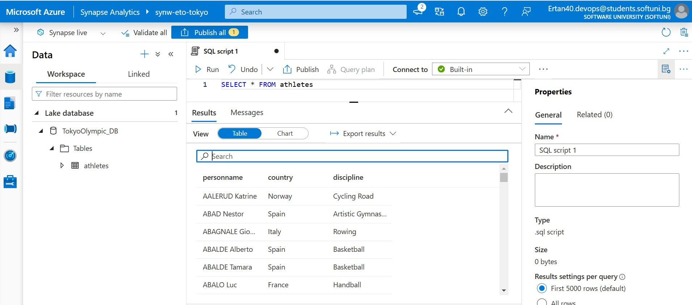

# Tokyo_Olympic_Azure_Data_Engineering_Project
 Transform Tokyo Olympic dataset from on-premises Postgresql Server to Azure Delta Lake Storage. Starting with CSV files to upload into Postgresql with Python script, the data is ingested into the Azure ecosystem via Azure Data Factory from Postgresql. It's initially stored in Azure Data Lake Storage Gen2, then transformed in Azure Databricks. The enriched data, once again housed in ADLS Gen2, undergoes advanced analytics in Azure Synapse. The insights are finally visualized in Azure Synapse and were ready for Power BI analyses.

 ## <ins>Business Objective<ins>
 This project serves as a learning opportunity for common data engineering practices, focusing on ETL pipeline techniques. The skills sharpened here are valuable for small to medium-sized businesses aiming to migrate their local data to the cloud.

1. <b>Architecture Diagram</b>:
    - 

## Dataset used
 This contains the details of over 11,000 athletes, with 47 disciplines, along with 743 Teams taking part in the 2021(2020) Tokyo Olympics. This dataset contains the details of the Athletes, Coaches, Teams participating as well as the Entries by gender. It contains their names, countries represented, discipline, gender of competitors, name of the coaches.
Source(Kaggle): [2021 Olympics in Tokyo](https://www.kaggle.com/datasets/arjunprasadsarkhel/2021-olympics-in-tokyo)

## Azure Services Used
- Azure Data Factory: For data ingestion from GitHub.
- Azure Data Lake Storage Gen2: As the primary data storage solution.
- Azure Databricks: For data transformation tasks.
- Azure Synapse Analytics: To perform in-depth data analytics.

## <ins>Current Environment</ins>
- Note: You have to have Azure account and can check out How to create free account!
- Utilized the Tokyo olympic dataset from Kaggle.
- Imported the dataset using Python to Postgresql.

- Create a Resource Group and manage all the Azure resources associated with this project.
- Within the created resource group,set up a storage account. This is specifically configured to leverage Azure Data Lake Storage(ADLS) Gen2 capabilities.
- Create a Container inside this storage account to hold the project's data. Two directories 'raw-data' and 'transfromed-data' are created to store raw data and transformed data.

## <ins>1. Data Ingestion</ins>
Data ingestion from the on-premises Postgresql server to Azure SQL is accomplished via Azure Data Factory. The process involves:

1. Installation of Self-Hosted Integration Runtime.
2. Establishing a connection between Azure Data Factory and the local Postgresql server.

3. Begin by creating an Azure Data Factory workspace within the previously established resource group.
4. After setting up the workspace, launch the Azure Data Factory Studio.
5. Within the studio, initialize a new data integration pipeline. Now use the task Copy Data to move data efficiently between various supported sources and destinations.
6. Configuring the Data Source with Postgresql in order to get the data from Postgresql.
7. Establishing the Linked Service for source.
8. Configuring the File Format for and setting up the Linked Service Sink.
9. Repeat above steps to load all the datasets. Note: you can loop as well.
10. You can connect all the copy data activity together and run them all at once.

  

11. After the pipeline completes its execution, navigate to your Azure Data Lake Storage Gen2. Dive into the "raw_data" folder and validate that the files, like "athletes.csv", "medals.csv", etc., are present and populated with the expected data.

 

## <ins>2. Data Transformation</ins>
1. Navigate to Azure Databricks within the Azure portal and create a workspace within the previously established resource group and launch it.
2. Start with configuring Compute in Databricks.
3. Create a new notebook within Databricks and rename it appropriately, reflecting its purpose or the dataset it pertains to.
4. Establishing a Connection to Azure Data Lake Storage (ADLS)
5. Using the credentials (Client ID, Tenant ID, Secret), write the appropriate code in the Databricks notebook to mount ADLS.

 
6. Do not forget to give permission to container > "tokyo-olympic-data" via Access Control (IAM) in order to avoid permission errors.

8. Writing Data Transformations mount ADLS Gen2 to Databricks.
9. Writing Transformed Data to ADLS Gen2.

 

## <ins>3. Data Loading</ins>
Data from the "transformed-data" folder is loaded into the Lake Database. Azure Synapse is used for this purpose. The steps involved are:

1. Creating a Synapse Analytics Workspace.
2. Within Workspace navigate to the "Data" section , choose "Lake Database" and create a Database "TokyoOlympic_DB"
3. Creating Table from Data Lake from the Transformed Data folder within your ADLS Gen2 storage.

  

 

 

## <ins>4. Data Analysis</ins>
You can create SQL scripts to Perform Exploratory data analysis using SQL. You can also use PowerBI to generate your analysis reports.Power BI connects directly to the cloud pipeline using DirectQuery to dynamically update the database. But I added some SQL scripts for simple data analysis in this project without Power BI analysis.

